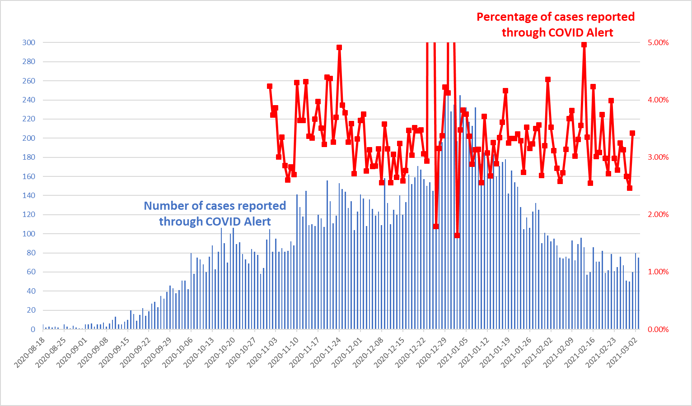
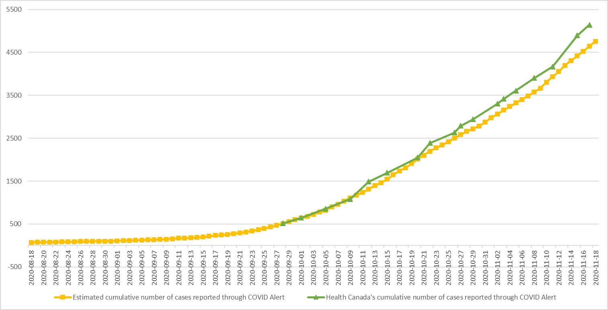

# Unofficial COVID Alert Dashboard

This project tries to infer the number of COVID-19 infections reported through [COVID Alert](https://github.com/cds-snc/covid-alert-app), Canada's exposure notifications app. This project is not affiliated with Health Canada or the Canadian Digital Service maintaining COVID Alert.

COVID Alert users who get infected with COVID-19 use the app to send diagnosis keys to a central server. Diagnosis keys are used by the app to generate the Bluetooth identifiers broadcast by the phone. Other COVID Alert app users will download the uploaded diagnosis keys from the server and use them to find matches among the Bluetooth identifers broadcast by nearby smartphones and captured by their phone. This project retrieves the diagnosis keys not to find matches, but to estimate the number of app users who reported an infection. 

The blue line shows our estimates of the daily number of COVID-19 cases reported through the COVID Alert app. The red line displays how many percent these numbers correspond to out of all COVID-19 cases reported for the eight provinces that support COVID Alert (data from [COVID-19 in Canada](https://art-bd.shinyapps.io/covid19canada/)).

The yellow line shows the cumulative total of our estimates. The green line displays the total number of cases reported through COVID Alert as irregularly [provided by Health Canada](https://www.canada.ca/en/public-health/services/diseases/coronavirus-disease-covid-19/covid-alert.html) (scroll down on that page to see the number).

[Raw data](DiagnosisKeysAnalysis.csv)

All numbers are for the nine provinces/territories where the COVID Alert app is currently active (Manitoba, New Brunswick, Newfoundland and Labrador, Northwest Territories, Nova Scotia, Ontario, Prince Edward Island, Quebec, Saskatchewan). We cannot compute province-specific estimates.

## Estimation Algorithm

Our algorithm for estimating the daily number of infections works as follows:

1. Once an hour, we retrieve the diagnosis keys uploaded so far today. The server is configured to return all keys uploaded before the top of the hour.
The retrieval takes advantage of [retrieve-canadian-diagnosis-keys](https://github.com/uhengart/retrieve-canadian-diagnosis-keys). 
2. We determine the set of diagnosis keys uploaded in the previous hour. 
3. For each key in the set, we analyze whether it was uploaded as part of a new infection or as part of a previously reported infection.

The final step is the trickiest one and requires some guessing so the numbers reported above are just estimates. We make available the result of step 2 so that others can easily reproduce step 3 or come up with better estimation approaches:

[Uploaded diagnosis keys per hour](https://kappel.cs.uwaterloo.ca/uhengart/diagnosis-keys/hourly_uploads.txt) (updated once per day)

Information not of relevance for step 3, such as the actual key value or the transmission risk level, which unfortunately is the same for all uploaded keys, is omitted from the file. Each entry consists of two values: the first one indicating when the key was uploaded, the second one the day when the key was used to generate Bluetooth identifiers. All times are in the UTC timezone. For example, "2020-09-08_14:00 2020-08-31" denotes a key that was uploaded on Sep 9, 2020 sometime between 2 and 3pm (UTC) and that was valid on Aug 31.

In theory, there are only two types of key uploads. The first type are uploads associated with a new infection. Here, 13 diagnosis keys get uploaded, each valid on one of the 13 days preceding the day when the infection gets reported. Note that the key valid on the day when the infection gets reported will be uploaded only on the following day, which brings us to the second type of key uploads. The second type of uploads are associated with a previously reported infection. Namely, on each of the 15 (14?) days following the day when the 13 initial keys were uploaded, the key that was valid on the previous day will get uploaded. 

The example below shows the keys that were uploaded on Sept 17, 2020 between 2 and 3pm (UTC):

    2020-09-17_12:00 2020-09-04
    2020-09-17_12:00 2020-09-05
    2020-09-17_12:00 2020-09-06
    2020-09-17_12:00 2020-09-07
    2020-09-17_12:00 2020-09-08
    2020-09-17_12:00 2020-09-09
    2020-09-17_12:00 2020-09-10
    2020-09-17_12:00 2020-09-11
    2020-09-17_12:00 2020-09-12
    2020-09-17_12:00 2020-09-13
    2020-09-17_12:00 2020-09-14
    2020-09-17_12:00 2020-09-15
    2020-09-17_12:00 2020-09-16
    2020-09-17_12:00 2020-09-16
    2020-09-17_12:00 2020-09-16
    2020-09-17_12:00 2020-09-16
    2020-09-17_12:00 2020-09-16
    2020-09-17_12:00 2020-09-16

Here, the first 13 keys come from a new infection. The first key was valid on Sept 4, the second one on Sept 5, ..., and the 13th on Sept 16. Next, we have five keys that each belong to an infection that was reported before Sept 17. The upload of these five keys happened on Sept 17, so the uploaded keys are the ones that were valid on Sept 16.

In practice, the observed patterns may become more complicated. As of October 2020, when reporting an infection, a COVID Alert user is given the option to indicate the day when symptoms started to appear or the day when the user took took the test. COVID Alert will then upload only the keys for the two days preceding this day. An infected user may have installed COVID Alert for fewer than 13 days before the day of reporting the infection, so fewer than 13 keys will get uploaded initially. In the worst case, no key gets uploaded initially and our algorithm will miss the infection. If only one key gets uploaded for a new infection, we cannot (easily) distinguish the reporting of the new infection from uploads that are due to a previously reported infection. Sometimes, there are gaps in the sequence of keys uploaded for a new infection. It is unclear what causes this gap (the smartphone being off for a day?) but these cases are easier to handle. Each key upload requires consent by the infected user and it is possible that the user does not consent to all of the uploads, in particular, uploads following the initial upload. Our estimation algorithm requires that there is a sequence of at least three keys, with the sequence ending on the current or previous day, to count the sequence as a new infection. Therefore, in the example below, we count two new infections.

    2020-09-17_14:00 2020-09-04
    2020-09-17_14:00 2020-09-05
    2020-09-17_14:00 2020-09-06
    2020-09-17_14:00 2020-09-07
    2020-09-17_14:00 2020-09-08
    2020-09-17_14:00 2020-09-09
    2020-09-17_14:00 2020-09-10
    2020-09-17_14:00 2020-09-11
    2020-09-17_14:00 2020-09-12
    2020-09-17_14:00 2020-09-13
    2020-09-17_14:00 2020-09-14
    2020-09-17_14:00 2020-09-14
    2020-09-17_14:00 2020-09-15
    2020-09-17_14:00 2020-09-15
    2020-09-17_14:00 2020-09-15
    2020-09-17_14:00 2020-09-16
    2020-09-17_14:00 2020-09-16
    2020-09-17_14:00 2020-09-16

An alternative approach to estimate the number of daily infections is to divide the number of diagnosis keys uploaded on a given day by 28. This approach exploits the observation that each infected user uploads 28 (27?) diagnosis keys. However, this approach has two disadvantages: First, the computed number would be correct only if the number of infections per day were constant; otherwise, the number is only an approximation. Second, an infected user may report fewer than 28 diagnosis keys, so this approach would underestimate the number of infections. Given the changes to the uploading behaviour as of October 2020 (see above) and that, according to our data, most users choose the option to indicate the day where symptoms started to appear or they took the test, this approach no longer makes sense.
