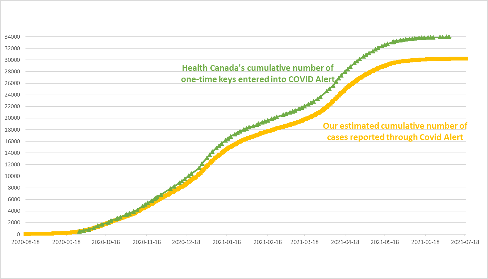
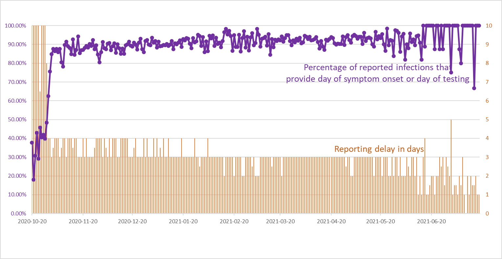

# Unofficial COVID Alert Dashboard

The unofficial COVID Alert dashboard shows the number of COVID-19 infections reported through [COVID Alert](https://github.com/cds-snc/covid-alert-app), Canada's exposure notifications app, and the delay in reporting these infections. This project is not affiliated with Health Canada or the Canadian Digital Service maintaining COVID Alert.

COVID Alert users who get infected with COVID-19 use the app to submit diagnosis keys to a central server. Diagnosis keys are used by the app to generate unique Bluetooth identifiers, which are broadcast by a phone and captured by nearby phones. Other COVID Alert app users download the uploaded diagnosis keys from the server and use them to find matches among the Bluetooth identifers captured by their phone. This project retrieves the diagnosis keys from the central server not to find matches, but to estimate
* the number of people who reported an infection through the COVID Alert app and
* the delay between a COVID Alert user first experiencing symptoms and the user reporting their infection.

In the following figure, the blue bars show our estimates of the daily number of COVID-19 cases reported through the COVID Alert app (see our [Estimation Algorithm](#dailyNumber)). The red line displays the estimated percentage of COVID-19 cases that were reported through the COVID Alert app (for the nine provinces and territories where COVID Alert is supported, data from [COVID-19 in Canada](https://art-bd.shinyapps.io/covid19canada/)).

In the next figure, the yellow line shows the cumulative number of COVID-19 cases reported through the COVID Alert app, as determined based on our daily estimates above. The green line displays the cumulative number of COVID-19 cases reported through the COVID Alert app, as [irregularly provided by Health Canada](https://www.canada.ca/en/public-health/services/diseases/coronavirus-disease-covid-19/covid-alert.html) (scroll down on that page to see the number).

In the final figure, the orange bars show the delays in reporting infections (see our [Estimation Algorithm](#dailyDelay)). Namely, for all infected users who used COVID Alert to alert others of a possible exposure on a given day, the orange bar for that day shows the median number of days passed for these users since they first experienced symptoms. For example, for the users who used COVID Alert to alert others of an exposure on Dec 11, they first experienced symptoms around three days ago so there was a delay of three days. Ideally, for COVID Alert to be most effective and breaking chains of infections as quickly as possible, there should be no delay. The reason is that infected users are most contagious during the two days before onset of symptoms. Therefore, we want infected users to alert their contacts as quickly as possible after symptom onset so that the contacts can self-isolate. The purple line shows the percentage of infected users who indicated the day when they first experienced symptoms or when they took the test. Users are not required to provide this information when reporting an infection with COVID Alert.

All numbers are for the nine provinces and territories where the COVID Alert app is currently active (Manitoba, New Brunswick, Newfoundland and Labrador, Northwest Territories, Nova Scotia, Ontario, Prince Edward Island, Quebec, Saskatchewan). We cannot compute province or territory-specific estimates.

## Raw Data

[Raw data for upload numbers](DiagnosisKeysAnalysis.csv)  
[Raw data for upload delays](UploadDelay.csv)

## Estimation Algorithm for Daily Number of Reported Infections 

Our algorithm for estimating the daily number of reported infections works as follows:

1. Once an hour, we retrieve the diagnosis keys uploaded so far today. The server is configured to return all keys uploaded before the top of the hour.
The retrieval takes advantage of [retrieve-canadian-diagnosis-keys](https://github.com/uhengart/retrieve-canadian-diagnosis-keys). 
2. We determine the set of diagnosis keys uploaded in the previous hour. 
3. For each key in the set, we analyze whether it was uploaded as part of a new infection or as part of a previously reported infection.

The final step is the trickiest one and requires some guessing so the numbers reported above are just estimates. We make available the result of step 2 so that others can easily reproduce step 3 or come up with better estimation approaches:

[Uploaded diagnosis keys per hour](https://kappel.cs.uwaterloo.ca/uhengart/diagnosis-keys/hourly_uploads.txt) (updated once per day)

Information not of relevance for step 3, such as the actual key value or the transmission risk level, which unfortunately is the same for all uploaded keys, is omitted from the file. Each entry consists of two values: the first one indicating when the key was uploaded, the second one the day when the key was used to generate Bluetooth identifiers. All times are in the UTC timezone. For example, "2020-09-08_14:00 2020-08-31" denotes a key that was uploaded on Sep 9, 2020 sometime between 2 and 3pm (UTC) and that was valid on Aug 31.

In theory, there are only two types of key uploads. The first type are uploads associated with a new infection. Here, 13 diagnosis keys get uploaded, each valid on one of the 13 days preceding the day when the infection gets reported. Note that the key valid on the day when the infection gets reported will be uploaded only on the following day, which brings us to the second type of key uploads. The second type of uploads are associated with a previously reported infection. Namely, on each of the 15 (14?) days following the day when the 13 initial keys were uploaded, the key that was valid on the previous day will get uploaded. 

The example below shows the keys that were uploaded on Sept 17, 2020 between 2 and 3pm (UTC):

    2020-09-17_12:00 2020-09-04
    2020-09-17_12:00 2020-09-05
    2020-09-17_12:00 2020-09-06
    2020-09-17_12:00 2020-09-07
    2020-09-17_12:00 2020-09-08
    2020-09-17_12:00 2020-09-09
    2020-09-17_12:00 2020-09-10
    2020-09-17_12:00 2020-09-11
    2020-09-17_12:00 2020-09-12
    2020-09-17_12:00 2020-09-13
    2020-09-17_12:00 2020-09-14
    2020-09-17_12:00 2020-09-15
    2020-09-17_12:00 2020-09-16
    2020-09-17_12:00 2020-09-16
    2020-09-17_12:00 2020-09-16
    2020-09-17_12:00 2020-09-16
    2020-09-17_12:00 2020-09-16
    2020-09-17_12:00 2020-09-16

Here, the first 13 keys come from a new infection. The first key was valid on Sept 4, the second one on Sept 5, ..., and the 13th on Sept 16. Next, we have five keys that each belong to an infection that was reported before Sept 17. The upload of these five keys happened on Sept 17, so the uploaded keys are the ones that were valid on Sept 16.

In practice, the observed patterns may become more complicated. For example: 

* When reporting an infection, a COVID Alert user is given the option to indicate the day when they first experienced symptoms or the day when the user took the test. COVID Alert will then upload only the keys valid up to two days before this day. Moreover, if the user indicates the day of symptom onset, the uploading of additional diagnosis keys will stop ten days after this day. 
* An infected user may have installed COVID Alert for fewer than 13 days before the day of reporting the infection, so fewer than 13 keys will get uploaded initially. In the worst case, no key gets uploaded initially and our algorithm will miss the infection. If only one key gets uploaded for a new infection, we cannot (easily) distinguish the reporting of the new infection from uploads that are due to a previously reported infection. 
* Sometimes, there are gaps in the sequence of keys uploaded for a new infection. It is unclear what causes this gap (the smartphone being off for a day?) but these cases are easier to handle. 
* Each key upload (i.e., the initial one and all follow-ups) requires consent by the infected user. It is possible that a user does not consent to some of the uploads, in particular, uploads following the initial upload. 

Our estimation algorithm requires that there is a sequence of at least three keys, with the sequence ending on the current or previous day, to count the sequence as a new infection. Therefore, in the example below, we count two new infections.

    2020-09-17_14:00 2020-09-04
    2020-09-17_14:00 2020-09-05
    2020-09-17_14:00 2020-09-06
    2020-09-17_14:00 2020-09-07
    2020-09-17_14:00 2020-09-08
    2020-09-17_14:00 2020-09-09
    2020-09-17_14:00 2020-09-10
    2020-09-17_14:00 2020-09-11
    2020-09-17_14:00 2020-09-12
    2020-09-17_14:00 2020-09-13
    2020-09-17_14:00 2020-09-14
    2020-09-17_14:00 2020-09-14
    2020-09-17_14:00 2020-09-15
    2020-09-17_14:00 2020-09-15
    2020-09-17_14:00 2020-09-15
    2020-09-17_14:00 2020-09-16
    2020-09-17_14:00 2020-09-16
    2020-09-17_14:00 2020-09-16

## Estimation Algorithm for Upload Delays

The algorithm for estimating the delay between a user first experiencing symptoms and the user uploading their diagnosis keys exploits the sequence lengths output by the algorithm for estimating the daily number of reported infections. As mentioned in the [description of the algorithm](#dailyNumber), an infected user can indicate the day of symptom onset when uploading their diagnosis keys. Then, the sequence of uploaded diagnosis keys will start two days before the day of symptom onset and end the day before the upload day. For example, a user who first experienced symptoms on Dec 8 and uploads their diagnosis keys on Dec 10 (i.e., there was a delay of two days) will upload the diagnosis keys for Dec 6, 7, 8, and 9. Therefore, the upload delay is computed as the sequence length (four in the example) minus two.

The following caveats may affect our upload delay estimates:
* An infected user can indicate either the day of symptom onset or the day when they took the test before uploading their diagnosis keys. We do not have the user's choice. We do know the workflow within the COVID Alert app. The app first asks the user for the day of symptom onset. When the user chooses not to indicate this day, the user is asked next for the day when they took the test. Arguably, this workflow biases users who have experienced symptomps to indicate the day of symptom onset and not the day of testing. For users who indicate the day when they took the test, our estimate of the upload delay will be too low if they took the test after symptom onset (arguably the more likely case) or too high if they took the test before symptom onset.
* For a user who indicates neither the day of symptom onset nor the day of testing, a complete sequence of length 13 will be uploaded (but see next bullet). We do not consider such sequences in our computation of the upload delay. 
* As mentioned in the description of the algorithm for estimating the daily number of reported infections, there are multiple reasons why sequences of diagnosis keys that are for shorter than 13 days can be uploaded. A user indicating the day of symptom onset or testing is only one possible reason. This choice was added to COVID Alert only in October. Before this change, about 30% of the uploaded sequences were shorter than 13 days. Currently, about 90% are.
*  As mentioned in the description of the algorithm for estimating the daily number of reported infections, we do not consider sequences of length two as indicator for a reported infection. This is probably (one of) the reasons why our estimates of the number of reported infections are about 10% below the numbers released by Health Canada (see 2nd figure above). Not considering sequences of length two when estimating the upload delay will lead to an overestimate of the delay. Therefore, when computing the upload delay, we assume that our identified set of sequences with lengths between 3 and 12 corresponds to only 90% of the reported infections and that the remaining 10% had a sequence length of two.
